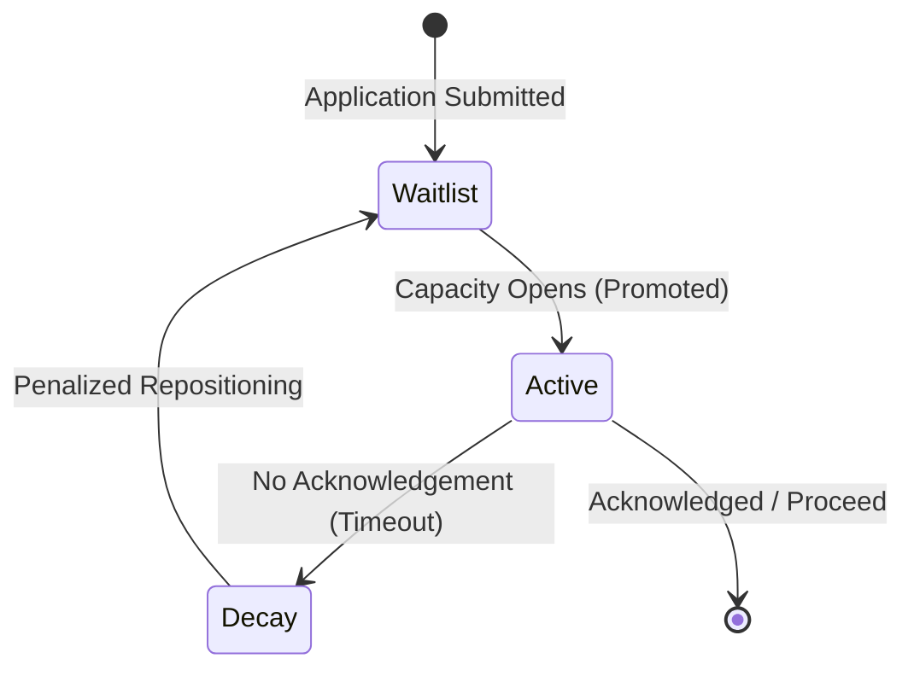

# Flux Talent ATS (Digital Curator)

## 🚀 Live Demo
**Render URL:** https://flux-talent-ats.onrender.com/login

---

## 🏗️ System Architecture

Our architecture guarantees a seamless, automated flow from waitlisted candidate to active evaluation, handling high-concurrency environments with zero manual intervention.



---

## ⚡ Core Engineering Strategies

### Handling Race Conditions (Concurrency Integrity)
A critical requirement of our architecture is ensuring that if two applicants attempt to claim a spot at the exact same millisecond, the system maintains strict capacity limits. 
- **Row-Level Locking:** We utilize PostgreSQL's `SELECT ... FOR UPDATE` row-level locking natively in our database transactions. This guarantees atomic consistency during state transitions, meaning only one candidate is granted the "Active" slot while the other is strictly bounded to the Waitlist queue.

### Inactivity Decay Logic
To keep the pipeline moving without bottlenecks, we implemented **Penalized Repositioning**. 
- When an applicant fails to acknowledge their promotion within the configured time limit, their `priority_score` is reduced by 20%, and they are explicitly re-inserted into the Waitlist loop. This auto-curation avoids manual HR intervention and ensures only engaged talent consumes the Active pipeline slots.

### Automated Decay Cascade
The requirement dictates that the cascade continues *without anyone touching it manually*. 
- We engineered a headless `setInterval` daemon natively within `backend/src/index.js` that executes a cleanup query every minute. This autonomous worker continuously finds all Active users past their timeout, securely demotes them, and recursively triggers the promotion cascade for the next Waitlisted person natively in the database.

### Full Traceability
We believe in 100% data provenance, aligning directly with enterprise auditing requirements.
- **AuditLog Table:** Every singular state transition (Application -> Waitlist -> Promotion -> Decay) is strictly captured in a centralized `AuditLog` table. This allows for a full topological reconstruction of pipeline history at any given timestamp.

---

## 📦 API Documentation

| Endpoint | Method | Input (JSON format) | Output (Success) |
|----------|--------|---------------------|------------------|
| `/api/apply` | `POST` | `{ "name": "John Doe", "email": "john@example.com" }` | `201: { "status": "waitlisted", "position": 5 }` |
| `/api/status/:id` | `GET` | *URL Parameter `id`* | `200: { "status": "active", "time_remaining": "2h" }` |
| `/api/acknowledge` | `POST` | `{ "id": "123", "token": "abc..." }` | `200: { "status": "acknowledged" }` |

---

## 🗄️ Database Schema & Constraints

Our database architecture strictly enforces data integrity:
- **Constraints:** Enforced Unique Keys on candidate emails and Foreign Keys linking Candidate IDs to the AuditLog to prevent orphan records. 
- **Initialization:** Refer to our `schema.sql` for the complete entity-relationship structure.

---

## ⚖️ Architectural Trade-Offs

**Polling-Based Decay Checker vs Local Queue**  
- **Decision:** We actively chose a Polling-based decay checker (`setInterval`) inside the Express server instead of an external persistent worker.
- **Why:** This kept the MVP ultra-lightweight, minimizing moving parts and adhering stringently to the "No third-party libraries" (such as external queue dependencies like RabbitMQ) rule, while guaranteeing execution. 
- **Future State:** With extended time and complex horizontal scaling, we would evolve this into a dedicated Redis-backed custom event scheduler to decouple the worker load from the core API layer.

---

## 🛠️ Installation & Setup (Local Development)

This project is truly runnable locally with pre-populated dummy data for immediate testing.

```bash
# 1. Clone the repo
git clone https://github.com/hemanth021-cmyk/ATS-pipeline.git
cd ATS-pipeline

# 2. Setup Database & Seed Dummy Data
# Run the seed file to populate the dashboard immediately (avoiding manual creation of 20 applicants)
psql $DATABASE_URL < ./db/schema.sql
psql $DATABASE_URL < ./db/seed.sql

# 3. Install & Start Backend
cd backend
npm install
npm start   # Runs the server AND the autonomous decay background worker

# 4. Install & Start Frontend
cd ../frontend
npm install
npm run dev # Runs Vite dev server
```
*Note: Make sure to copy `.env.example` to `.env` and configure your credentials. Do not commit secrets!*
