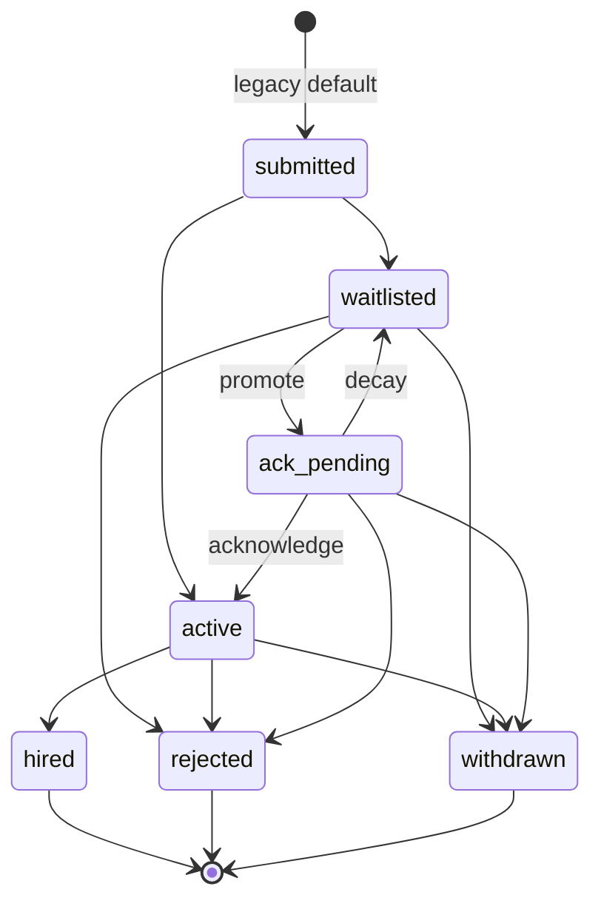

# ATS Pipeline (PERN)

Lightweight automated ATS pipeline: capacity-limited “active” slots, waitlist with promotion and acknowledgement, inactivity decay, PostgreSQL row-level concurrency, and a small React dashboard. **No Redis, Bull, or external job queues** — scheduling uses `setInterval` in Node.

## Repository layout

```
ats-pipeline/
├── backend/          # Express + pg
│   ├── src/db/init.sql
│   └── src/services/pipelineEngine.js, decayScheduler.js
├── frontend/         # Vite + React + TanStack Query
├── api/              # Vercel serverless handler
└── vercel.json       # Vercel deployment config
```

From this folder you can run **`npm run install:all`** once, then two terminals: **`npm run dev:api`** and **`npm run dev:web`**.

## Quick Deployment

### Deploy to Vercel (Recommended)

```bash
npm install -g vercel
vercel deploy
```

Then set environment variables in Vercel Dashboard (see `VERCEL_DEPLOYMENT.md` for details).

Alternatively, connect your GitHub repo directly in Vercel Dashboard for automatic deployments.

**See [`VERCEL_DEPLOYMENT.md`](./VERCEL_DEPLOYMENT.md) for complete deployment guide.**

---

## Setup

### Prerequisites

- Node.js 18+
- PostgreSQL

### Database

1. Create a database (e.g. `ats_pipeline`).
2. Copy `backend/.env.example` to `backend/.env` and set **`DATABASE_URL`**, **`JWT_SECRET`**, and optionally **`ACK_WINDOW_MINUTES`**, **`DECAY_CHECK_INTERVAL_MS`**, **`CORS_ORIGIN`**, **`PORT`**.

3. Apply schema:

```bash
cd backend
npm install
npm run migrate
```

`migrate` runs `src/db/init.sql` (companies, jobs, applications, audit_log, decay_timers).

### Backend

```bash
cd backend
npm run dev
```

Default URL: `http://localhost:3000`. Health: `GET /health`.

### Frontend

```bash
cd frontend
npm install
cp .env.example .env
# Set VITE_API_URL=http://localhost:3000
npm run dev
```

---

## Environment variables

| Variable | Where | Purpose |
|----------|--------|---------|
| `DATABASE_URL` | backend | PostgreSQL connection string |
| `JWT_SECRET` | backend | Required for signing/verifying company JWTs |
| `JWT_EXPIRES_IN` | backend | Optional (default e.g. `7d`) |
| `ACK_WINDOW_MINUTES` | backend | Minutes until ack deadline when promoted to `ack_pending` (default `120`) |
| `DECAY_CHECK_INTERVAL_MS` | backend | Decay scheduler tick interval (default `60000`) |
| `CORS_ORIGIN` | backend | Optional; e.g. `http://localhost:5173` (default allows all in dev) |
| `PORT` | backend | API port (default `3000`) |
| `VITE_API_URL` | frontend | API origin **without** `/api` suffix |

---

## Architecture decisions

### Polling instead of WebSockets

- The company dashboard refreshes pipeline data on a **30s** interval (React Query `refetchInterval`).
- The applicant status page **does not** poll; it loads once and offers a manual **Refresh** button.
- Acknowledgement windows are on the order of **hours**, and decay is checked every **minute** — near-real-time push is unnecessary and keeps the API stateless.

### PostgreSQL row locking instead of in-app mutexes

- Concurrent applicants for the same job are serialized with **`SELECT … FOR UPDATE`** on the `jobs` row inside a transaction (`submitApplication`).
- Promotions from the waitlist use **`FOR UPDATE SKIP LOCKED`** so multiple workers don’t block on different candidates.
- A **JavaScript mutex** would not protect across multiple Node processes or horizontal scaling; the database is the single source of truth for ordering and locking.

---

## Concurrency: last active slot

**Problem:** Two applicants submit at the same time when only one active slot remains.

**Approach (implemented in `submitApplication`):**

1. `BEGIN`
2. `SELECT … FROM jobs WHERE id = $1 FOR UPDATE` — locks that job row until commit.
3. Count `applications` with `status = 'active'` for that job.
4. If `active_count < active_capacity`, insert **`active`**; else insert **`waitlisted`** with the next waitlist position.
5. `COMMIT`

The **second** request blocks on the lock until the first transaction commits. When it runs, the active count reflects the first insert, so the second applicant correctly goes to the **waitlist**. No double-booking and no lost applicants.

`SKIP LOCKED` is used when promoting waitlisted users so concurrent promotion workers skip rows already locked by another transaction.

---

## Decay system

- When someone is promoted to **`ack_pending`**, a row is inserted into **`decay_timers`** with `ack_deadline = now + ACK_WINDOW_MINUTES` (default 2 hours).
- The decay scheduler (`decayScheduler.js`) runs every **`DECAY_CHECK_INTERVAL_MS`** (default 60s), finds timers where `ack_deadline < now()` and `is_processed = false`, and in a transaction:
  1. Locks the **`applications`** row with `FOR UPDATE`.
  2. If still `ack_pending`, moves them to **`waitlisted`** with  
     `new_position = MAX(waitlist_position) + 1 + (penalty_count * 3)`  
     using **current** `penalty_count`, then increments `penalty_count`.
  3. Marks the decay timer processed and writes **`audit_log`** with `reason = 'decay'`.
  4. Calls **`promoteNextWaitlisted`** so the vacated pipeline slot can fill from the waitlist.

---

## Application state machine

Valid statuses: `submitted`, `waitlisted`, `active`, `ack_pending`, `hired`, `rejected`, `withdrawn`.

Typical flows:

- **New apply:** `active` (if capacity) or `waitlisted`.
- **Promotion:** `waitlisted` → `ack_pending` (with timer + decay row).
- **Acknowledge:** `ack_pending` → `active` (applicant).
- **Exit:** `→ hired | rejected | withdrawn` (company or applicant); then cascade may promote from waitlist.
- **Decay:** `ack_pending` → `waitlisted` (penalized position) + cascade.



Note: new applications created by the pipeline engine are inserted directly as **`active`** or **`waitlisted`** (not `submitted`). The diagram above is **illustrative** of possible transitions, not every edge is used on every install.

---

## HTTP API

All JSON bodies use `Content-Type: application/json`. Unless noted, errors look like `{ "error": "message" }` with appropriate status codes (`400`, `401`, `403`, `404`, `409`, `500`).

### Health

| Method | Path | Auth |
|--------|------|------|
| GET | `/health` | No |

**200:** `{ "ok": true, "db": "up" }` (or 500 if DB unreachable).

---

### Auth

| Method | Path | Body | Response |
|--------|------|------|----------|
| POST | `/api/auth/register` | `{ "email", "password", "name"? }` | `201` `{ "token", "token_type": "Bearer", "company": { "id", "email", "name", "created_at" } }` |
| POST | `/api/auth/login` | `{ "email", "password" }` | `200` same shape as register |

**409** on duplicate email (register). Password minimum length: **8** (enforced by API).

---

### Jobs

Company routes require header: **`Authorization: Bearer <JWT>`**.

| Method | Path | Body / query | Response |
|--------|------|----------------|----------|
| POST | `/api/jobs` | `{ "title", "description"?, "active_capacity" }` | `201` job row |
| GET | `/api/jobs` | — | `{ "jobs": [ ... ] }` |
| GET | `/api/jobs/:id` | — | `{ "job", "pipeline_counts", "total_applications" }` |
| GET | `/api/jobs/:jobId/applications` | `?limit` & `?offset` | `{ "job_id", "applications", "total", "limit", "offset" }` |
| GET | `/api/jobs/:id/audit` | `?limit`, `?offset` | `{ "job_id", "entries", "limit", "offset" }` |
| PATCH | `/api/jobs/:id` | `{ "active_capacity"?, "status"?: "open" \| "closed" }` | `200` updated job |

**Public (no JWT):**

| Method | Path | Body | Response |
|--------|------|------|----------|
| POST | `/api/jobs/:jobId/apply` | `{ "applicant_name", "applicant_email" }` | `201` `{ "application" }` |

---

### Applications

| Method | Path | Auth | Body / query | Response |
|--------|------|------|----------------|----------|
| GET | `/api/applications/:id/status` | No | — | Public status payload (see below) |
| POST | `/api/applications/:id/withdraw` | No | `{ "applicant_email" }` | `200` `{ "application" }` |
| POST | `/api/applications/:id/acknowledge` | No | `{ "applicant_email" }` | `200` `{ "application" }` |
| GET | `/api/applications/:id/audit` | JWT | `?limit`, `?offset` | `{ "application_id", "entries", "limit", "offset" }` |
| PATCH | `/api/applications/:id/status` | JWT | `{ "status": "hired" \| "rejected" }` | `200` `{ "application" }` — **hire** only from `active` or `ack_pending` (API returns 400 otherwise) |

**GET `/api/applications/:id/status` (example):**

```json
{
  "application_id": 1,
  "job_id": 2,
  "job_title": "Engineer",
  "applicant_name": "Ada",
  "status": "waitlisted",
  "waitlist_position": 3,
  "ack_deadline": null
}
```

---

## Frontend routes

| Path | Purpose |
|------|---------|
| `/login` | Company register / login |
| `/dashboard` | Company pipeline (JWT) |
| `/status?id=<applicationId>` | Applicant status (no auth) |

---

## Production checklist

The implementation plan (steps 1–11) is complete; the sections below extend that with tests, Docker, CI, and single-process hosting.

### Environment (runtime)

| Variable | Purpose |
|----------|---------|
| `NODE_ENV` | Set `production` for production error messages and to enable static UI when `frontend/dist` exists |
| `SERVE_STATIC` | Set `true` to serve `frontend/dist` from Express even if `NODE_ENV` is not `production` (e.g. Docker) |
| `DISABLE_DECAY_SCHEDULER` | Set `true` to skip the decay `setInterval` (e.g. some test or special deployments) |
| `DATABASE_URL`, `JWT_SECRET`, `CORS_ORIGIN` | As in [Environment variables](#environment-variables) |

### Single server (API + SPA)

If `SERVE_STATIC=true` **or** (`NODE_ENV=production` **and** `frontend/dist` exists next to `backend/`), Express serves the built Vite app and falls back to `index.html` for client routes. Build the UI first, then start the API from the repo root layout:

```bash
npm run build:web
npm run start:api
```

With the default layout, static files resolve from `../frontend/dist` relative to `backend/src/app.js`.

### Tests

From `backend/`:

```bash
npm test
```

- Always runs a smoke test that `createApp()` returns an Express app.
- If **`DATABASE_URL`** is set (e.g. local `.env` or CI), runs **`GET /health`** against a real database.

From repo root: **`npm test`** runs backend tests only.

### Docker

Build and run the stack (Postgres + API that migrates on start and serves the SPA):

```bash
docker compose up --build
```

- UI + API: `http://localhost:3000` (set `JWT_SECRET` in the environment for real use).
- Postgres: `localhost:5432` (user/password/db `ats` — see `docker-compose.yml`).

Image build: `docker build -t ats-pipeline .` from the `ats-pipeline/` folder (multi-stage: builds `frontend`, copies `backend`, runs `migrate` then `node`).

### GitHub Actions

Workflow **`.github/workflows/ci.yml`**: on push/PR to `main`, `master`, or `develop`, installs dependencies, migrates a service Postgres database, runs **`npm test`** in `backend/`, builds the frontend, and runs **`docker build`** as a sanity check.

### Manual split hosting

1. **Database** — Run migrations once per environment (`npm run migrate`).

2. **Backend** — `NODE_ENV=production`, `JWT_SECRET`, `DATABASE_URL`, `CORS_ORIGIN` → `npm run start:api`.

3. **Frontend only** — Set `frontend/.env.production` **`VITE_API_URL`** to your public API origin (no `/api` suffix), then `npm run build:web`. Host `frontend/dist/` with SPA fallback to `index.html`.

4. **Health** — Monitor `GET /health`.

## Tradeoffs and Future Considerations

### Tradeoffs

1.  **In-Process Scheduler vs. Redis/Bull**: To meet the "No third-party queue" requirement, the decay scheduler uses `setInterval` in the Node process.
    -   *Pros*: Zero infrastructure overhead, fulfills project constraints.
    -   *Cons*: Not horizontally scalable (multiple replicas would run overlapping checks). For production scaling, this would be moved to a Postgres-backed worker (e.g., `graphile-worker`) or a dedicated cron service.
2.  **Polling vs. WebSockets**:
    -   *Pros*: Simple, stateless, handles high latency or intermittent connections gracefully.
    -   *Cons*: Up to 30 seconds of UI lag for pipeline updates. Given most hiring cycles take days, this is an acceptable tradeoff for tool simplicity.
3.  **Atomic DB Transactions over JS Locks**:
    -   *Pros*: Thread-safe even across multiple Node instances connecting to the same DB.
    -   *Cons*: Slightly higher DB load due to row locks, but minimal for a small team tool.

### What I'd Change with More Time

1.  **Real-Time Subscriptions**: Use Postgres `LISTEN/NOTIFY` or Supabase-style real-time updates to eliminate polling.
2.  **Email Integration**: Replace the mock `notificationService.js` with a real SendGrid or Postmark integration to notify applicants when they are promoted.
3.  **Analytics Dashboard**: Add time-to-hire and waitlist churn metrics for companies to evaluate their pipeline efficiency.
4.  **Bulk Actions**: Allow company admins to bulk reject or move multiple candidates at once.
5.  **Multi-Stage Pipeline**: Currently, the system has one "Active" bucket and one "Waitlist" bucket. Real ATS tools often have "Initial Screen," "Interview," "Technical," etc.
6.  **Full Test Suite**: While smoke tests exist, I would add full integration tests with `supertest` for every race condition and edge case in the state machine.

---


## License

Private / project use — adjust as needed.
